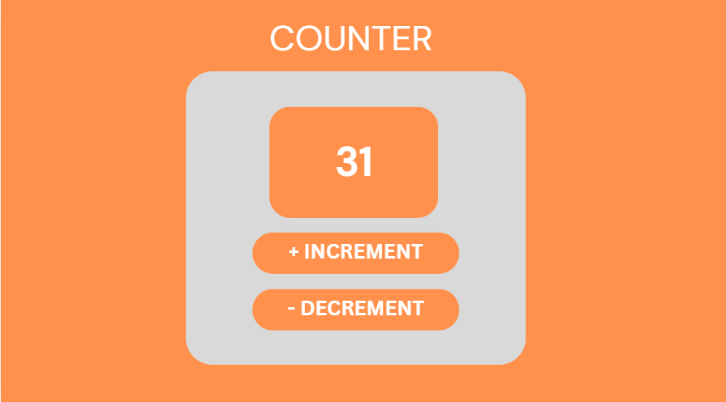

# Counter App

A simple counter application built with **HTML**, **CSS**, and **JavaScript**. The app allows users to increment and decrement a counter while saving the value using **Local Storage**, so it persists even after refreshing the page.

## Screenshot

  

> **Note:** Save your screenshot as `counter.png` inside an `images` folder.

##  Features

-  Increment the counter
-  Decrement the counter
-  Save counter value using Local Storage
-  Responsive and modern UI
-  Built with Vanilla JavaScript

##  Technologies Used

- HTML5
- CSS3
- JavaScript (ES6)

## 📚 Concepts Covered

- DOM Manipulation
- Event Handling
- Local Storage
- Variables
- Functions
- Conditional Logic

## How to Run

-https://task3part1counter.netlify.app/

##  Author

**EMAN SAJJAD**