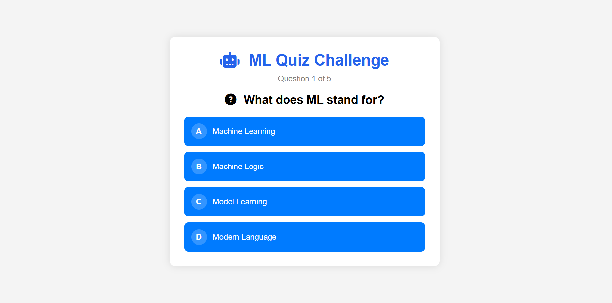

# ML Quiz Challenge

A responsive quiz application built with **HTML**, **CSS**, and **JavaScript**. The app presents multiple-choice questions about Machine Learning, calculates the user's score, and displays the final result dynamically.

## 📸 Screenshot

<p align="center">
  
</p>

> **Note:** Save your project screenshot as `quiz.png` inside the `images` folder.

## ✨ Features

-  Machine Learning themed quiz
-  Multiple-choice questions
-  Score calculation
-  Final result screen
-  Restart quiz functionality
-  Responsive design
-  Built with Vanilla JavaScript

##  Technologies Used

- HTML5
- CSS3
- JavaScript (ES6)
- Font Awesome

##  Concepts Covered

- Arrays & Objects
- DOM Manipulation
- Event Handling
- Conditional Logic
- Dynamic Content Updates
- Functions
- Loops (`forEach`)
- Timers (`setTimeout`)

##  Project Structure

```text
ML-Quiz-Challenge/
│
├── index.html
├── style.css
├── script.js
├── README.md
└── ima/
    └── quizlayout.png
```

##  How to Run

-https://task3partcquizapp.netlify.app/

##  Author

**EMAN SAJJAD**