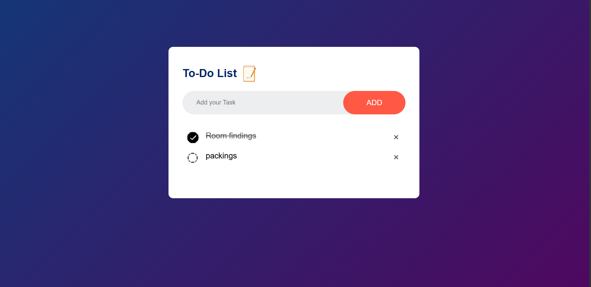

# To-Do List App

A responsive To-Do List application built with **HTML**, **CSS**, and **JavaScript**. Users can add, complete, and delete tasks, with all data stored in **Local Storage** so tasks remain after refreshing the page.

##  Screenshot

  

> **Note:** Save your project screenshot as `todo.png` inside the `images` folder.

##  Features

-  Add new tasks
-  Mark tasks as completed
-  Delete tasks
-  Save tasks using Local Storage
-  Responsive design
-  Built with Vanilla JavaScript

## 🛠️ Technologies Used

- HTML5
- CSS3
- JavaScript (ES6)

##  Concepts Covered

- DOM Manipulation
- Event Handling
- Event Delegation
- Dynamic Element Creation
- Local Storage
- Functions
- Conditional Logic

##  How to Run

-https://task3part2todo.netlify.app/

## Author

**EMAN SAJJAD**