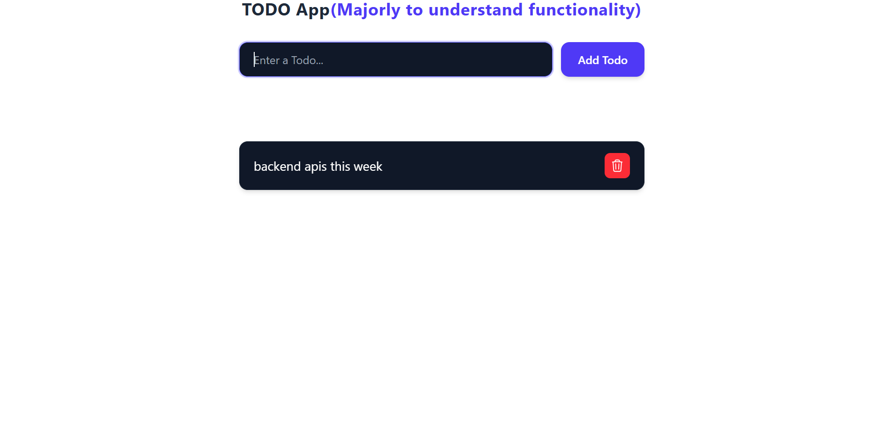

# Todo App

A simple Todo application built with React and Redux Toolkit to understand state management and React fundamentals.

## Features

- Add new todos
- Remove todos
- Manage global state using Redux
- Responsive UI
- Modern styling with Tailwind CSS

-https://todotaskwithnotes.netlify.app/

---

## Screenshot

Here is a preview of the Todo App interface:

## Concepts Practiced

### React
- Functional Components
- JSX
- useState Hook
- Component communication
- Event handling

### Redux Toolkit
- Store setup
- Provider
- createSlice
- useDispatch
- useSelector

### Tailwind CSS
- Responsive layouts
- Utility-first styling
- Custom UI design

---

# React Fundamentals Notes

This repository contains my learning notes for React fundamentals.

## Topics Covered

### 1. JSX
### 2. Functional Components
### 3. Props
### 4. useState Hook
### 5. useEffect Hook
### 6. Conditional Rendering
### 7. List Rendering

---

## Purpose

The purpose of these notes is to build a strong foundation in React and understand how React components, state, and rendering work.

## Technologies

- React.js
- JavaScript (ES6+)
- JSX