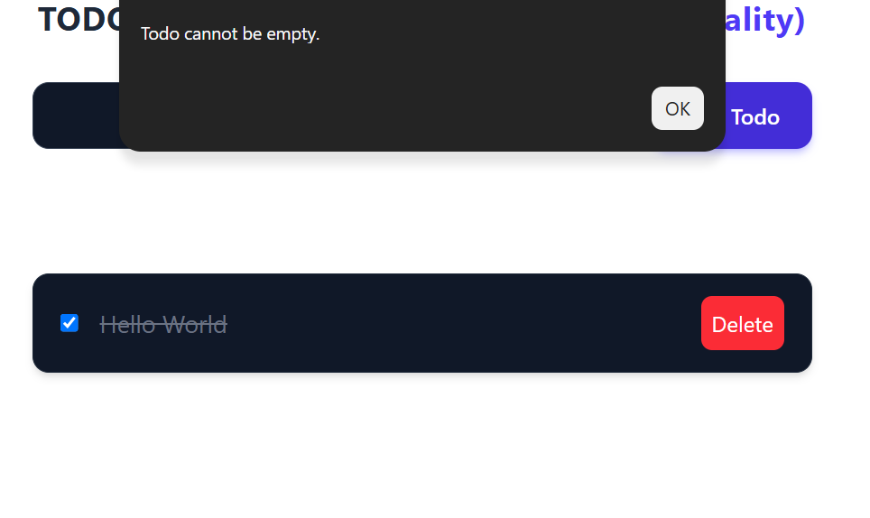
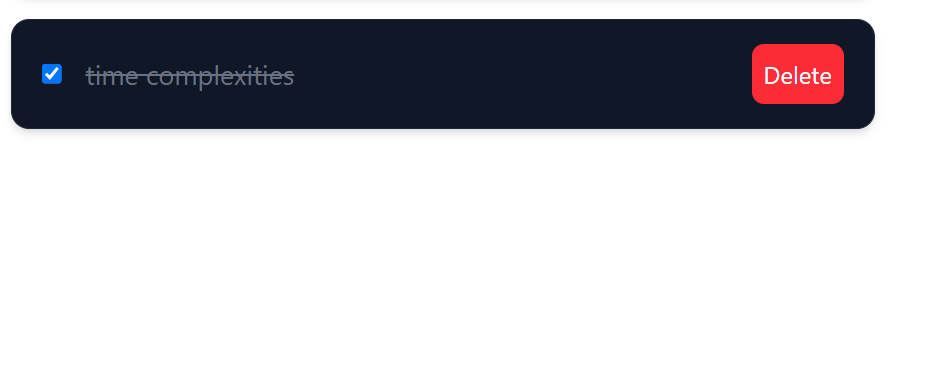
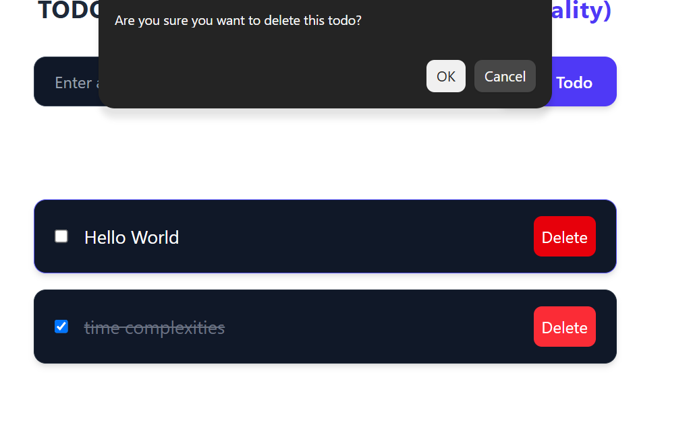
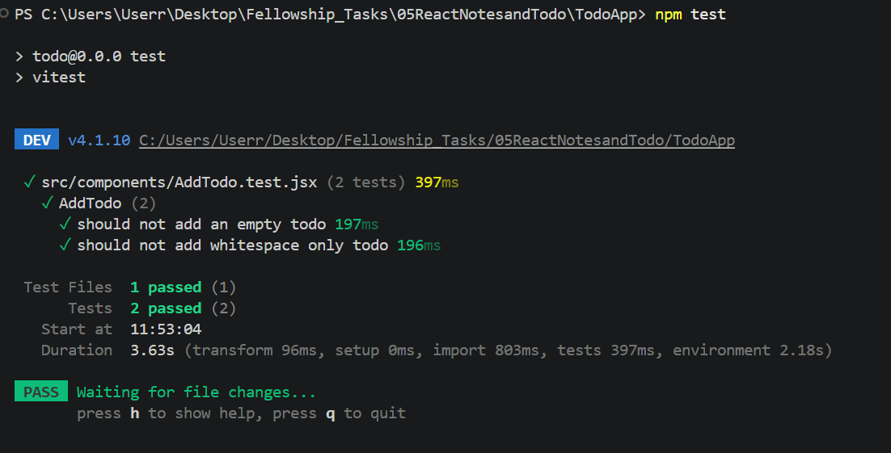

# Todo App

A simple Todo application built with React and Redux Toolkit to understand state management and React fundamentals.

# Improvements MADE

# Prevent empty todos

# Complete/mark todo as done

# Confirmation before deleting

# Automated tests for invalid input

--- 

## Features

- Add new todos
- Remove todos
- Manage global state using Redux
- Responsive UI
- Modern styling with Tailwind CSS

---

## Concepts Practiced

### React
- Functional Components
- JSX
- useState Hook
- Component communication
- Event handling

### Redux Toolkit
- Store setup
- Provider
- createSlice
- useDispatch
- useSelector

### Tailwind CSS
- Responsive layouts
- Utility-first styling
- Custom UI design

---
