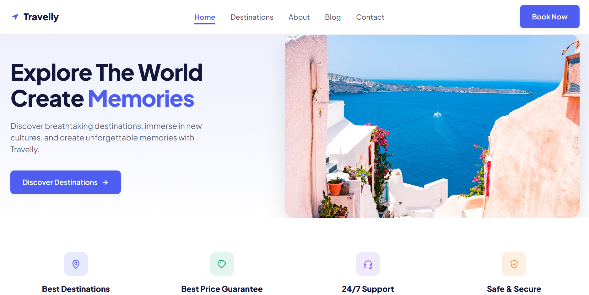

# 🌍 Travelly

A modern and responsive travel landing page built with **React** and **CSS**. Travelly helps users explore beautiful destinations and provides an elegant interface for discovering travel experiences.

---

##  Features

-  Modern and clean UI design
-  Fully responsive layout
-  Travel destination showcase
-  Built with React functional components
-  Smooth and user-friendly navigation
-  Reusable and organized component structure

---

##  Technologies Used

- React.js
- CSS3
- JavaScript (ES6+)
- Vite

---

## checkout the web

- https://task6travellapp.netlify.app/

##  Future Improvements

- Add destination search functionality
- Integrate booking system
- Add dark mode
- Add animations using Framer Motion
- Connect with travel APIs for real data

---

##  Author

**Eman**

---
