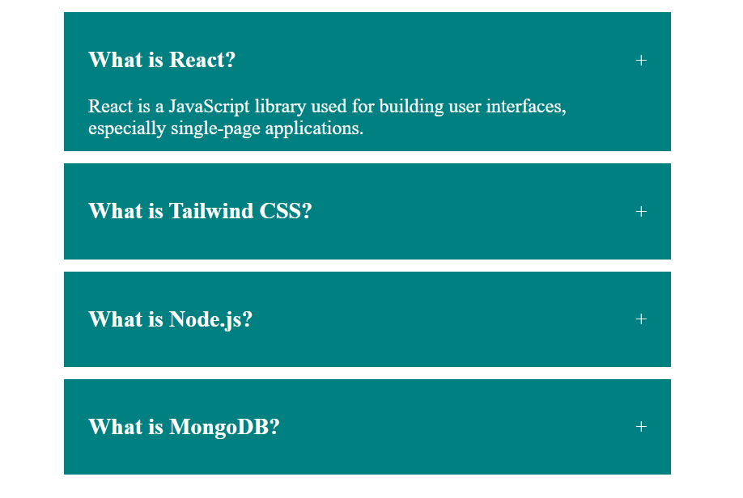
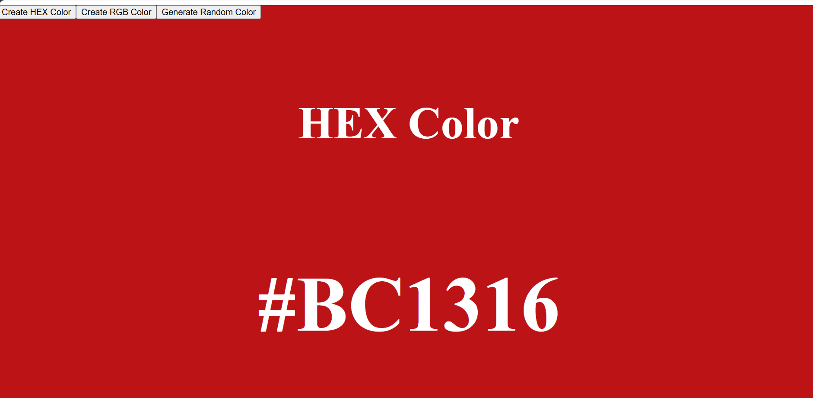
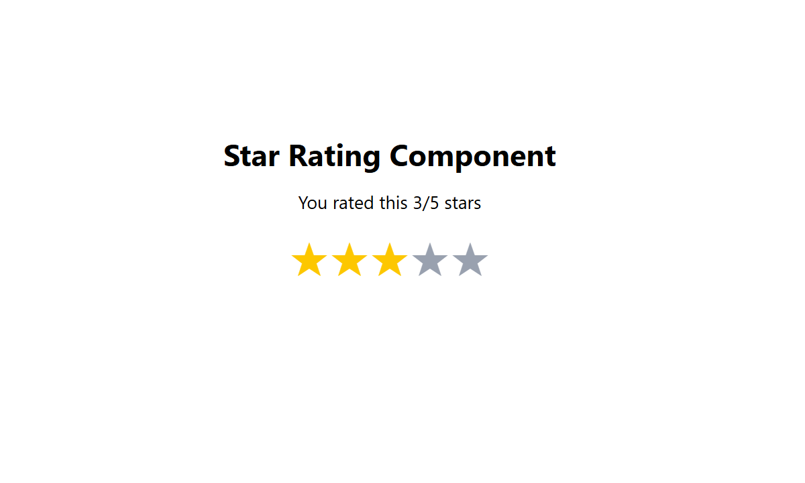
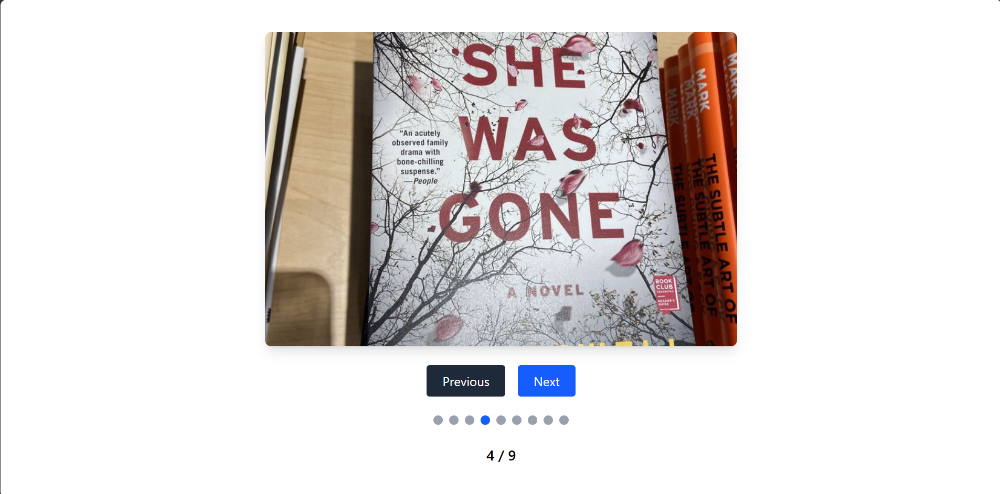
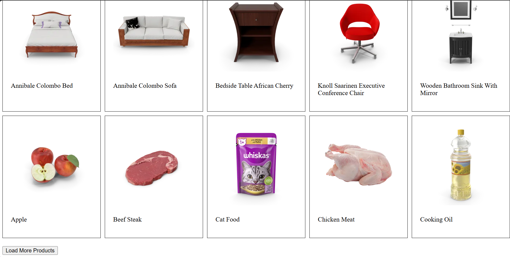

#  React Mini Projects Collection

A collection of beginner-friendly React projects built to practice core React concepts such as state management, conditional rendering, event handling, component composition, and working with APIs.

---

##  Projects Included

### 1. Accordion

An interactive accordion component with two different modes:

- ✅ Single Selection Accordion
- ✅ Multiple Selection Accordion
- Toggle questions by clicking on their titles.
- Uses React state to manage expanded items.

### Screenshot

---

##  2. Random Color Generator

A simple application that generates different types of colors.

### Features

- Generate Hex Colors
- Generate RGB Colors
- Generate Completely Random Colors
- Instantly updates the page background

### Screenshot

---

##  3. Star Rating Component

An interactive star rating system.

### Features

- Click to rate from 1 to 5 stars
- Selected stars are highlighted
- Displays the current rating
- Built using React state

### Screenshot

---

##  4. Image Slider

A simple image carousel built with React.

### Features

- Previous button
- Next button
- Circular navigation
- Image counter
- Responsive layout

### Screenshot

---

##  5. Load More Component

A product listing application with dynamic loading.

### Features

- Fetches product data
- Displays products in batches
- Load More button
- Automatically stops when all products are loaded

### Screenshot

---

##  6. Tree View (Nested Menu)

A recursive tree view component for displaying nested menus.

### Features

- Expand and collapse menu items
- Supports multiple levels of nesting
- Dynamic rendering using recursion
- Ideal for file explorers or navigation menus

### Screenshot

---

#  Technologies Used

- React.js
- JavaScript (ES6+)
- JSX
- Tailwind CSS
- CSS3
- HTML5

---

#  Concepts Practiced

- React Components
- JSX
- Props
- useState Hook
- Conditional Rendering
- Event Handling
- Lists & Keys
- Array `map()`
- Recursive Components
- API Fetching
- Dynamic Rendering
- State Management
- Component Reusability

---