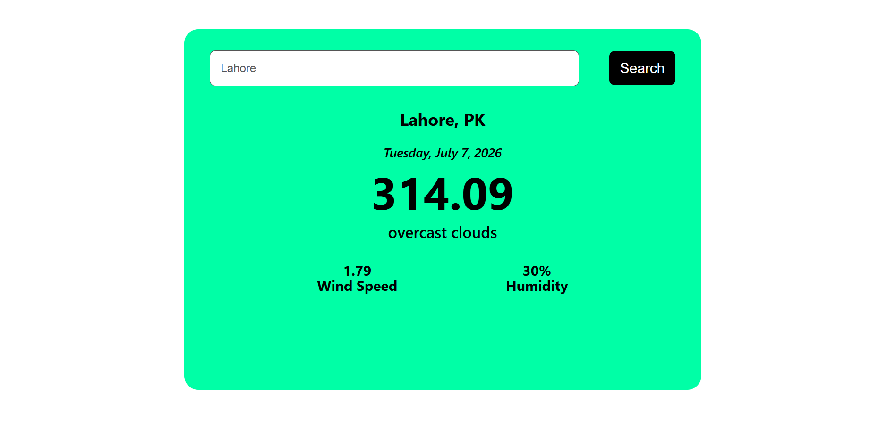
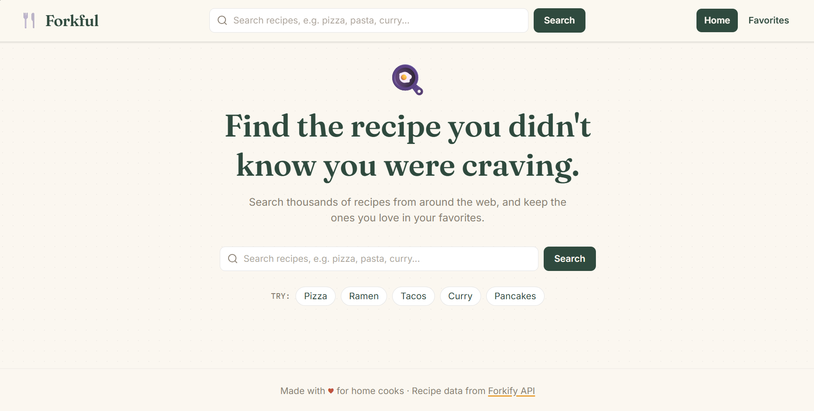

# 🌦️ Weather App

A modern and responsive weather application built with React, Vite, and Tailwind CSS. The app provides real-time weather information for any city using a weather API, featuring a clean and user-friendly interface.

---

##  Features

- Search weather by city name
- Current temperature display
- Weather condition and description
- Humidity information
- Country and location details
- Fast performance with Vite
- Modern UI using Tailwind CSS

-https://weatherappstasks.netlify.app/

---

## Screenshots

### Home Page

---

##  Tech Stack

- React.js
- Vite
- JavaScript (ES6+)
- Weather API
- Fetch API

---

## 📖 Learning Outcomes

This project helped practice:

- React Components
- React Hooks
- State Management
- API Integration
- Fetch API
- Conditional Rendering
- Responsive Design
- Tailwind CSS
- Error Handling
- Loading States

---

# 🍽️ Food Recipe App

A modern Food Recipe web application built with React, Vite, Context API, React Router, and Tailwind CSS. The application allows users to search recipes, view complete recipe details, and save their favorite recipes.

---

##  Features

- Search recipes by name
- Fetch recipes using the Forkify API
- View detailed recipe information
- Add or remove recipes from Favorites
- Display ingredients list
- Fast search experience
- Modern interface built with Tailwind CSS

-https://foodrecipeswebapp.netlify.app/
---

## 📸 Screenshots

---

## 🛠️ Tech Stack

- React.js
- Vite
- React Router DOM
- Context API
- Tailwind CSS
- JavaScript (ES6+)
- Forkify API
- Fetch API

---

##  How It Works

1. Search for a recipe using the search bar.
2. Browse matching recipes.
3. Click **Recipe Details** to view complete information.
4. View ingredients and recipe details.
5. Add or remove recipes from your Favorites list.

