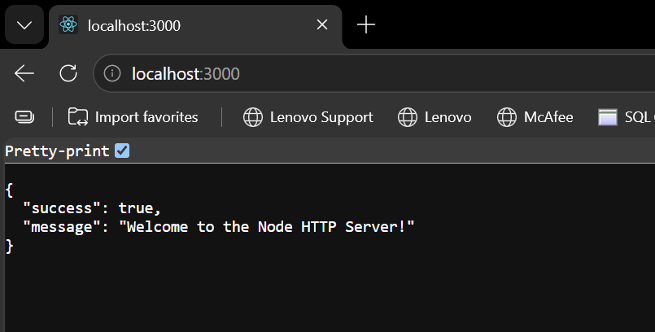
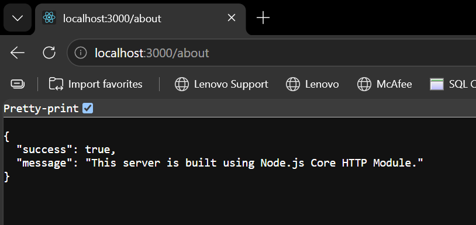
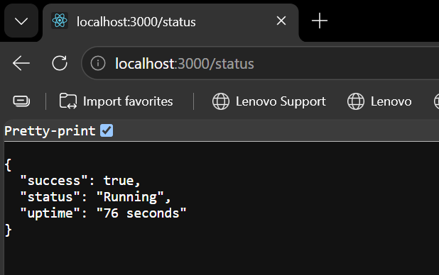
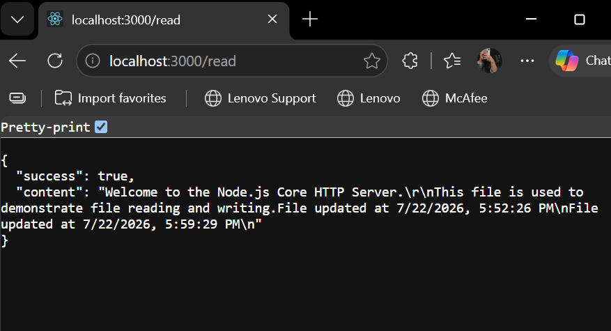
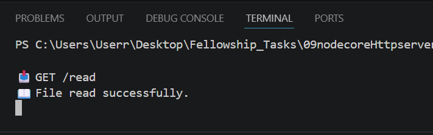
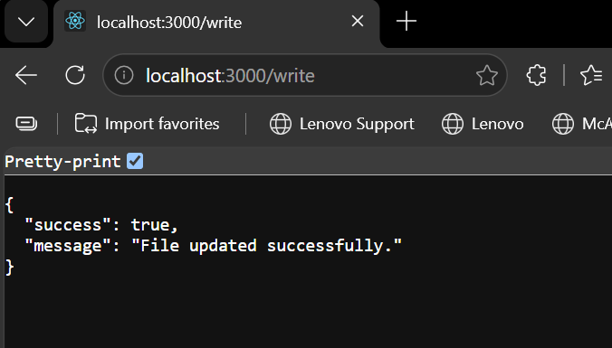
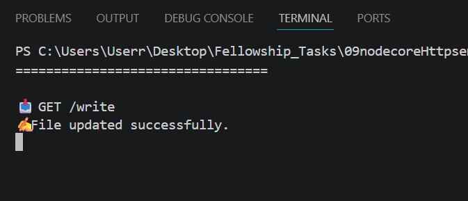
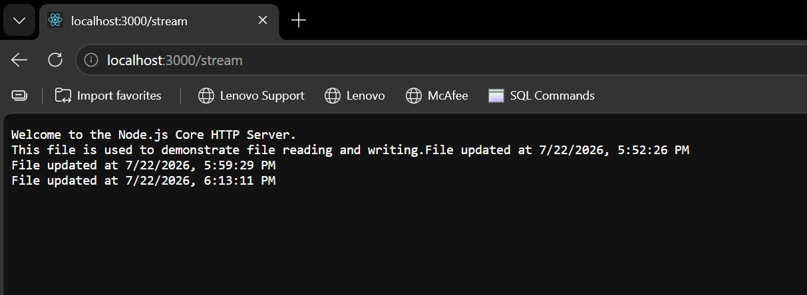
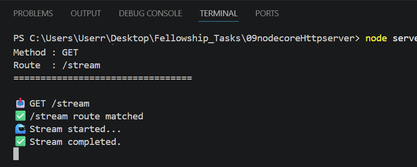
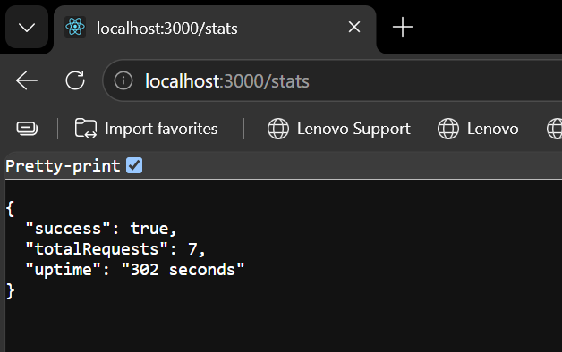

# Node Core HTTP Server

A mini backend project built using Node.js Core Modules without Express.

## Features

- HTTP Server using `http`
- Modular Routing
- Controllers
- File Reading (`fs/promises`)
- File Writing (`fs`)
- File Streaming
- EventEmitter
- Request Logging
- Request Counter
- JSON Responses
- Query Parameters
- Custom 404 Handling
- Server Status Endpoint

## Project Structure

```
node-http-server/
│
├── controllers/
├── data/
├── routes/
├── utils/
├── server.js
└── README.md
```

## Available Routes

| Route | Description |
|--------|-------------|
| `/` | Home |
| `/about` | About server |
| `/status` | Server uptime |
| `/stats` | Request statistics |
| `/read` | Read file |
| `/write` | Append to file |
| `/stream` | Stream file |

# 📸 Screenshots

## Home Route



---

## About Route



---

## Status Route



---

## Read File





---

## Write File




---

## Stream File




---

## Stats Endpoint



---

## Technologies Used

- Node.js
- HTTP Module
- File System (fs)
- Streams
- Events

Server:

```
http://localhost:3000
```